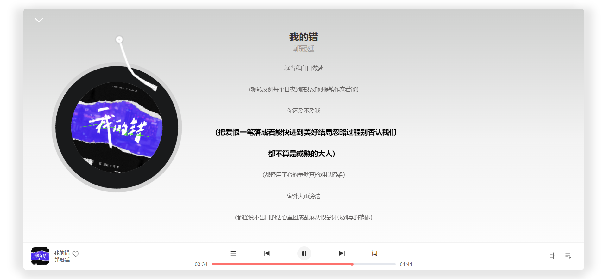

<<<<<<< HEAD
# 

<br>
<p align="center">
<a href="http://adjfks.github.io/NeteaseCloudMusic-Website/" target="_blank">

</a>
</p>

<p align="center">
仿 <b>网易云音乐</b><b>Web</b>App
</p>

<p align="center">
<a href="https://github.com/adjfks/NeteaseCloudMusic-Website" target="__blank"></a>
</p>

<p align="center">
  <a href="http://net.swttws.top">在线网站</a>
</p>

<p align="center">
 <p align="center">首页展示</p>
 
 <p align="center">歌曲播放页展示</p>
 
</p>


## 自动构建和部署
使用Github Actions + Docker + Docker Compose + Praefik + Nginx实现了项目的自动构建和部署，并可通过域名访问。

## Getting Started

需要先克隆[NeteaseCloudMusicApi](https://github.com/Binaryify/NeteaseCloudMusicApi)到本地，然后进入该项目文件夹运行一下命令启动后台服务
```
node app.js
```

安装依赖
```
pnpm install
```
启动开发环境
```
pnpm run dev
```

## 提供Api接口服务
[NeteaseCloudMusicApi](https://github.com/Binaryify/NeteaseCloudMusicApi)
=======
# WyyMusicPlayer
>>>>>>> 72eb818baf603b4a8d7365969ed800147f8d7de1
